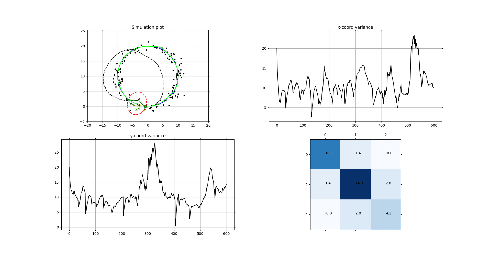

# ProbabilisticRrobotics
Implementation of probabilistic robotics book

Author: Minwoo shin
Date: 2021-Aug-01

This code implements 2D robot pose estimation with Extended Kalman filter. The robot control move around circular trajectory with small input noise. The environment has landmarks around True trajectory. robot observe and move at unit time interval. So far, the state of the robot consists of (x,y,theta), and observes the landmark within a distance of 3 units. Also, the observation contain with small noise. you can modify many environment parameters and Covariance matrices. So far we have included position and heading as states, but we will add velocity and angular velocity as states in the future, and UKF will also be implemented.

The plot below shows the execution of this code. As far as I know, the diagonal component of the covariance should decrease over time. However, this fraction increases with each new observation, and has not yet been analyzed.

There are so many failure cases.. Mabye solving them is fun too!

